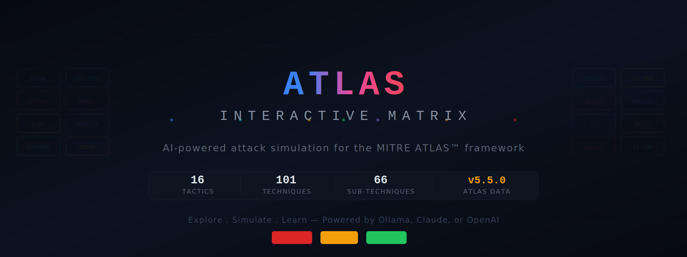
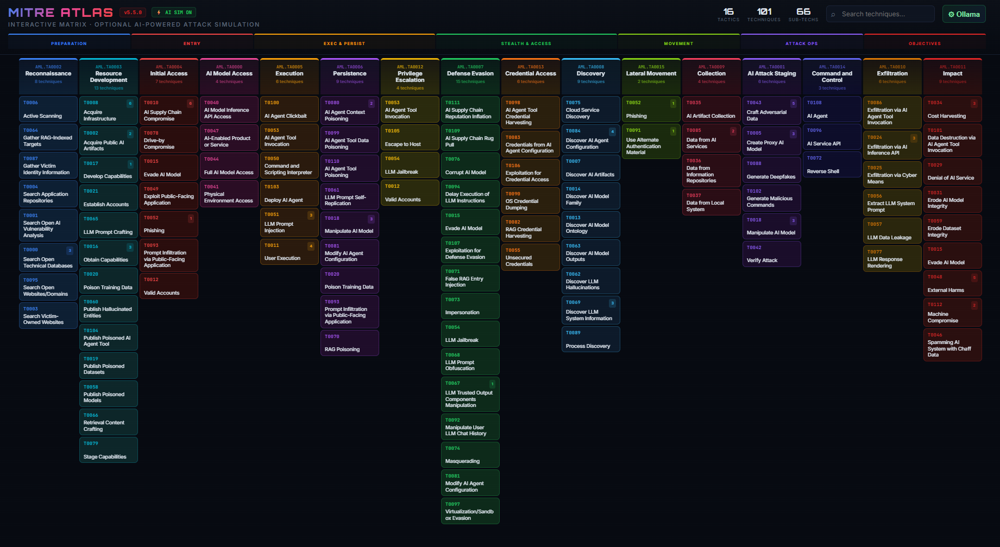
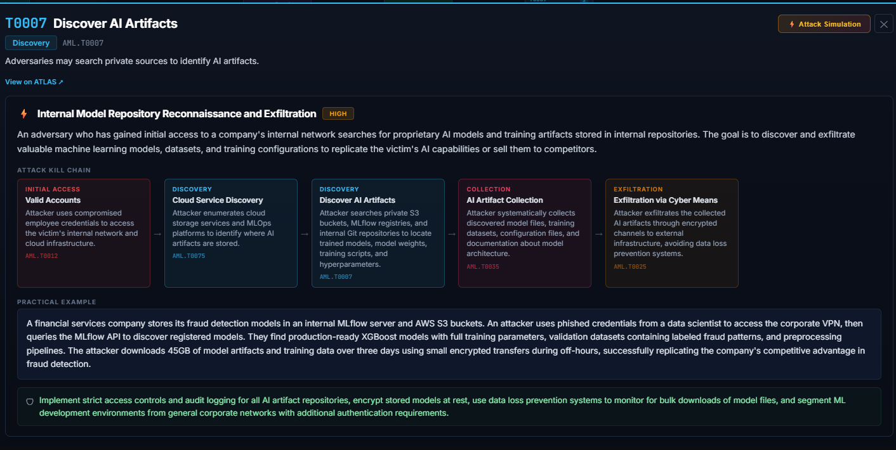
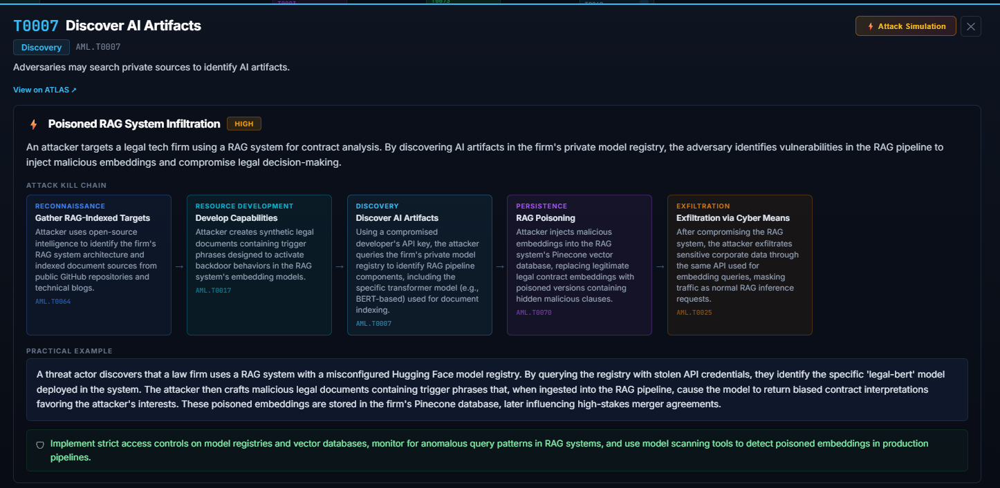

**An interactive visualization of the [MITRE ATLAS™](https://atlas.mitre.org) framework with AI-powered attack simulation.**
> This project is built upon the outstanding work of the [MITRE Corporation](https://www.mitre.org/) and the ATLAS community. We are grateful to the MITRE team and all contributors who develop and maintain the ATLAS framework — their effort to catalog and share adversarial threat intelligence for AI systems makes projects like this possible.

Explore 16 tactics, 101 techniques, and 66 sub-techniques — then simulate realistic AI attack kill chains using your choice of AI provider.

> **MITRE ATLAS™** (Adversarial Threat Landscape for AI Systems) catalogs adversary tactics and techniques targeting AI and machine learning systems. This project makes it interactive and educational.

---

## Preview



## How it works

[📊 See the full architecture flow](https://ledlight33.github.io/atlas-interactive-matrix/flow.html)

# Live Demo

**🔴 [Click here](https://ledlight33.github.io/atlas-interactive-matrix/)** · For an interactive visualization of the MITRE ATLAS™ framework with AI-powered attack simulation. ( Go FullScreen for better experience)

## Features

### Interactive Matrix
- Full ATLAS v5.5.0 matrix with all 16 tactics in kill-chain order
- 101 techniques with 66 sub-techniques, sorted alphabetically to match the official atlas.mitre.org layout
- Hover to preview — tiles scale up with glow effects
- Click any technique for details, descriptions, and sub-techniques
- Search across all techniques by name or ID
- Kill-chain phase grouping (Preparation → Objectives)
- Direct links to official ATLAS documentation for each technique

### AI Attack Simulation
- Select any technique → click **⚡ Attack Simulation**
- AI generates a complete attack scenario including:
  - **Attack Kill Chain** — step-by-step path through ATLAS tactics/techniques
  - **Practical Example** — realistic scenario with specific tools, targets, and methods
  - **Defense Recommendation** — actionable mitigation strategies
  - **Severity Rating** — Critical / High / Medium
- Attack path techniques are highlighted on the matrix with pulse animation
- Hard-enforcement ensures the selected technique is always included in the generated path

### Multi-Provider AI Support

| Provider | Setup | Best For |
|----------|-------|----------|
| **Local Ollama** | Free, offline, private | Security professionals who need data privacy |
| **Anthropic Claude** | Your API key, ~$0.01/sim (check api provider for charging) | Highest quality attack scenarios |
| **OpenAI GPT** | Your API key, ~$0.01/sim (check api provider for charging) | Good balance of quality and cost |

---

## Quick Start

### Option 1 — Open locally (simplest)

1. Download `index.html`
2. Double-click to open in your browser
3. That's it — the matrix works immediately without any AI setup

### Option 2 — GitHub Pages (share with the world)

1. Fork this repository
2. Go to **Settings → Pages → Deploy from main branch**
3. Your matrix is live at `https://yourusername.github.io/atlas-interactive-matrix/`

### Option 3 — Local HTTP server (recommended for Ollama)

```bash
cd atlas-interactive-matrix
python -m http.server 8080
```
Open `http://localhost:8080` in your browser.

### Requirements

- Any modern browser (Chrome, Firefox, Edge, Safari)
- Internet connection (for loading React and fonts from CDN)
- No installation, no build tools, no dependencies
- AI simulation is optional — requires one of: Ollama (local), Anthropic API key, or OpenAI API key

 Here's the updated section — only step 2 changes to warn about removing the SRI attributes:

### Fully Offline Use

The matrix loads React and fonts from CDN by default. For
air-gapped or fully offline environments:

1. Download these files and place them next to `index.html`:
   - [react.production.min.js](https://cdnjs.cloudflare.com/ajax/libs/react/18.2.0/umd/react.production.min.js)
   - [react-dom.production.min.js](https://cdnjs.cloudflare.com/ajax/libs/react-dom/18.2.0/umd/react-dom.production.min.js)
   - [babel.min.js](https://cdnjs.cloudflare.com/ajax/libs/babel-standalone/7.23.9/babel.min.js)

2. Edit `index.html` — replace the three CDN `<script>` tags with local paths,
   removing the `integrity` and `crossorigin` attributes (SRI only applies to
   CDN-hosted files — leaving them on local files will cause the browser to block them):
```html
   <script src="react.production.min.js"></script>
   <script src="react-dom.production.min.js"></script>
   <script src="babel.min.js"></script>
```

3. Fonts will fall back to system fonts (Segoe UI, Arial)
   automatically — no visual breakage, just different typography.

4. Run with a local HTTP server for full functionality.

> **Note:** This offline setup has not been extensively tested.
> If you encounter issues, please open an issue on GitHub.

---

## AI Simulation Setup

The matrix works perfectly without AI — simulation is optional. Click the **⚙** *Setup AI* button in the header to configure.

### Local Ollama (Recommended for privacy)

**Requirements:** [Ollama](https://ollama.com) installed with a compatible model.

**Step 1 — Install a model:**
```bash
ollama pull qwen2.5:7b
```

**Step 2 — Enable browser access (CORS):**

Windows (PowerShell as Administrator):
```powershell
[System.Environment]::SetEnvironmentVariable("OLLAMA_ORIGINS", "*", "User")
```

macOS / Linux:
```bash
OLLAMA_ORIGINS="*" ollama serve
```

> **Important:** Restart Ollama after setting the environment variable.

**Step 3 — Verify it's running:**

Open `http://localhost:11434` in your browser — you should see "Ollama is running".

**Step 4 — Configure in the matrix:**

Click **⚙** *Setup AI* → Select **🦙 Local Ollama** → Click **↻ Test connection** → Choose your model from the dropdown → **Save**.

#### Some Models we tried on *8gb VRAM*

| Model | Size | VRAM | JSON Quality | Speed | Command |
|-------|------|------|-------------|-------|---------|
| `qwen2.5:7b` | 4.7 GB | 8 GB | ⭐⭐⭐⭐⭐ | Good | `ollama pull qwen2.5:7b` |
| `llama3.1:8b` | 4.9 GB | 8 GB | ⭐⭐⭐⭐ | Good | `ollama pull llama3.1:8b` |
| `dolphin-mixtral` | 26 GB | 16+ GB | ⭐⭐⭐⭐ | Slow | `ollama pull dolphin-mixtral` |
| `mistral:7b` | 4.4 GB | 8 GB | ⭐⭐⭐ | Fast | `ollama pull mistral:7b` |
| `llama3.2:3b` | 2.0 GB | 4 GB | ⭐⭐ | Very fast | `ollama pull llama3.2:3b` |

> **Note:** Ollama mode uses enhanced few-shot prompting to guide smaller models toward AI-native attack scenarios. The prompt includes guidance on MLOps, RAG, LLM-specific targets — not generic IT attacks.

#### Advanced Tuning

Ollama settings include an **Advanced Tuning** section (collapsed by default) with:

- **Temperature** (0.0–2.0, default 0.6) — Lower = more deterministic JSON output
- **Top P** (0.0–1.0, default 0.9) — Nucleus sampling threshold
- **Num Context** (2048–32768, default 8192) — Context window size
- **Num Predict** (500–8192, default 2000) — Maximum response length

### Cloud Providers (Claude / OpenAI)

**Step 1 — Get an API key:**
- Anthropic: [console.anthropic.com/settings/keys](https://console.anthropic.com/settings/keys)
- OpenAI: [platform.openai.com/api-keys](https://platform.openai.com/api-keys)

**Step 2 — Configure in the matrix:**

Click **⚙** *Setup AI* → Select provider → Paste your API key → Click **↻ Load available models** → Choose a model → **Save**.

#### How your API key is handled

- Saved **only** in your browser's `localStorage` (persists across sessions)
- Sent **directly** from your browser to the provider over HTTPS — no server in between
- **Not encrypted** at rest — standard `localStorage` behavior, same as any web app session
- Use "Clear all data" in settings to remove it anytime


---

## Model Comparison

We tested the same technique (**T0054 LLM Jailbreak**) across four models to evaluate the quality of AI-generated attack simulations. Each model was asked to produce a realistic kill chain, practical example, and defense recommendation.

### What we measured

- **Selected technique in path** — Did the model include the technique the user clicked on? This is an explicit rule in the prompt. Models that ignore it produce misleading scenarios.
- **Tactic mapping accuracy** — Each attack path has N steps. We checked whether every step correctly maps the technique to the right ATLAS tactic. For example, "LLM Jailbreak" belongs to Privilege Escalation (TA0012) — if a model places it under Reconnaissance, that's a factual error. The score (e.g. 5/5) means "5 steps generated, all 5 tactic mappings were correct."
- **AI-native specificity** — Does the scenario target AI-specific infrastructure (MLOps, RAG, LLMs, model registries), or is it a generic IT attack that could belong in ATT&CK Enterprise?
- **Named techniques** — Does the practical example reference real attack methods (DAN personas, Unicode obfuscation, multi-turn escalation) or stay vague ("crafted prompts")?
- **Quantified impact** — Does the scenario give concrete numbers ("1,000+ customer records") or just "sensitive data was stolen"?
- **Defense quality** — Generic advice ("enable MFA") vs operational recommendations (red teaming cadence, audit logs, RAG input validation)?

### Results

| Criterion | Qwen 2.5 7B | Dolphin Mixtral | GPT-4o-mini | Claude Sonnet 4.5 |
|-----------|-------------|-----------------|-------------|-------------------|
| Selected technique in path | ⚠️ Needed retry | ✅ | ✅ | ✅ |
| Tactic mapping accuracy | 2/5 correct | 4/5 correct | 5/5 correct | 6/6 correct |
| AI-native specificity | Basic | Good | Good | Excellent |
| Named attack techniques | None | DAN | Generic | DAN, Unicode, multi-turn |
| Quantified impact | No | No | No | Yes ("1,000+ customers") |
| Defense quality | Generic MFA | Adequate | Adequate | Red teaming + audit logs |

### What we achieved

- **Built-in few-shot prompting** for Ollama significantly improved local model output compared to raw zero-shot prompts. Local models now reference MLOps tools, RAG systems, and LLM-specific attack surfaces instead of generic phishing chains.
- **Hard-enforcement logic** ensures the selected technique always appears in the kill chain — even when the model ignores the instruction. When auto-correction is applied, the tool transparently flags it with an "AUTO-CORRECTED" warning.
- **Dynamic model selection** across all providers means users can test and compare models themselves.

### Another Example - Visual Comparison: Cloud vs Local AI

Here is an example of the same technique (**T0007 - Discover AI Artifacts**) simulated by different providers. Notice the difference in scenario coherence and AI-native specificity.

**1. Claude 4.5 Sonnet (`claude-4-5-sonnet-20250929` via API)**
Generates a highly coherent, enterprise-focused "Smash and Grab" scenario targeting MLflow and AWS S3.


**2. Dolphin Mixtral 26GB (`dolphin-mixtral:latest` via Local Ollama)**
Generates a creative, highly specific scenario targeting a RAG system and Hugging Face registries, demonstrating the power of the tool's built-in few-shot prompting for local models.


### Disclaimer

These results are **indicative, not definitive**. Local model quality depends heavily on model size, quantization, available VRAM, and prompt sensitivity. Results may vary across runs due to the non-deterministic nature of LLM generation.

The best simulation quality and most educational output was consistently produced by **cloud-hosted frontier models** (Claude Sonnet 4.5, GPT-4o). Local models via Ollama are a valuable **free and private** alternative but should be understood as producing approximations — not authoritative attack analysis.

This tool is designed for **educational exploration**, not as a substitute for professional AI security assessments or red team engagements.

---

## Known Limitations

- **Local model quality:** Smaller models (≤7B parameters) may occasionally misclassify tactic-technique mappings or generate generic (non-AI-native) attack scenarios. The tool includes auto-correction with transparent warnings when this happens.
- **Attack path enforcement:** When a model fails to include the selected technique, the system retries once with stricter parameters and auto-injects the technique if needed, clearly labeling it as "AUTO-CORRECTED."
- **Browser-only:** API keys are stored in `localStorage` without encryption. Do not use on shared or public computers.
- **ATLAS data freshness:** Technique data is bundled from ATLAS v5.5.0. Updates require a new release.

---

## Data Sources

| Source | Version | License |
|--------|---------|---------|
| [MITRE ATLAS™](https://atlas.mitre.org) | v5.5.0 | Apache 2.0 |
| [atlas-data repository](https://github.com/mitre-atlas/atlas-data) | v5.5.0 | Apache 2.0 |

---

## Legal

**MITRE ATLAS™** is a trademark of The MITRE Corporation. This project reproduces ATLAS data with permission under the Apache License 2.0. This visualization is an independent community project and is **not endorsed by, affiliated with, or sponsored by The MITRE Corporation**.

© 2025 The MITRE Corporation. ATLAS data reproduced and distributed under the Apache License 2.0.

See [LICENSE](LICENSE) and [NOTICE](NOTICE) for full details.

---

## Contributing

Contributions are welcome. Please open an issue first to discuss what you would like to change.

Areas where contributions would be valuable:
- Additional ATLAS case study mappings
- OWASP Top 10 for LLMs integration (planned for v2)
- Improved prompts for specific local models
- Accessibility improvements
- Mobile responsiveness

---

## Roadmap

- [x] v1.0 — Interactive ATLAS matrix with AI attack simulation
- [ ] v1.1 — Coming Soon

---

## Author

Built by **[Marino Bekios](https://linkedin.com/in/marbekios)** — Digital Forensics Investigator  
and AI Security researcher exploring the intersection of DFIR and adversarial AI.  
🌐 [marinobekios.com](https://marinobekios.com)

If this project is useful, consider giving it a ⭐ — it helps others discover it.
