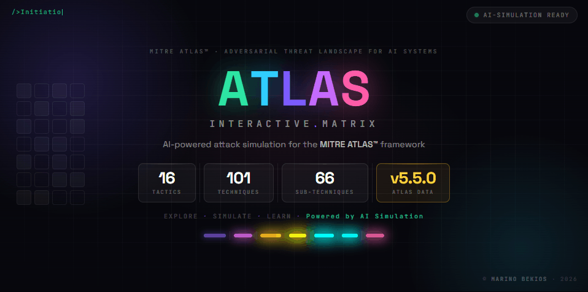
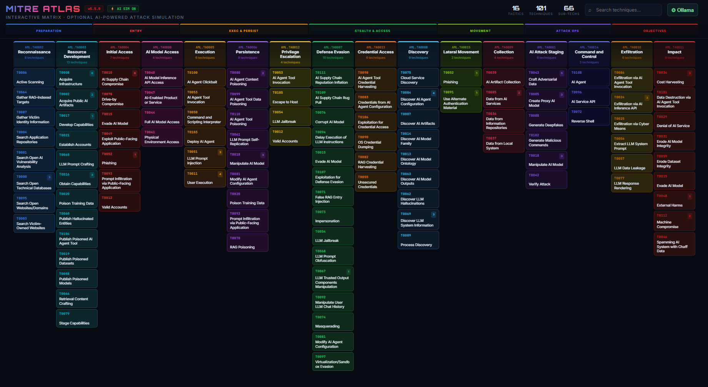
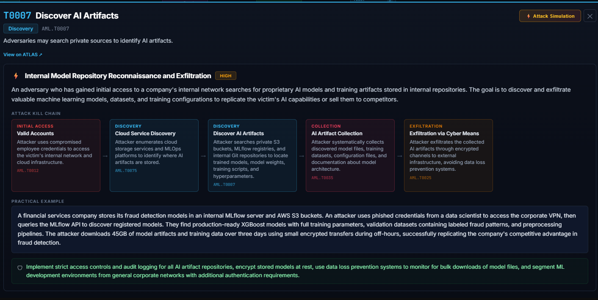
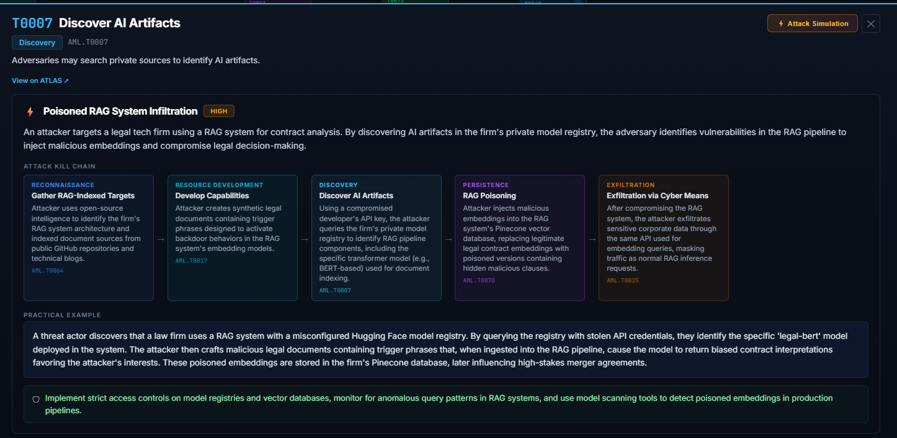

**An interactive visualization of the [MITRE ATLAS™](https://atlas.mitre.org) framework with AI-powered attack simulation.**
> This project is built upon the outstanding work of the [MITRE Corporation](https://www.mitre.org/) and the ATLAS community. We are grateful to the MITRE team and all contributors who develop and maintain the ATLAS framework. Their effort to catalog and share adversarial threat intelligence for AI systems makes projects like this possible.

Explore 16 tactics, 101 techniques and 77 sub-techniques, replay 68 real attack chains that MITRE has documented, and simulate new ones using your choice of AI provider.

> **MITRE ATLAS™** (Adversarial Threat Landscape for AI Systems) catalogs adversary tactics and techniques targeting AI and machine learning systems. This project makes it interactive and educational.

---

## Preview



## How it works

👇 Click on the image to open the interactive flow

[](https://ledlight33.github.io/atlas-interactive-matrix/flow.html)

# Live Demo

**🔴 [Click here](https://ledlight33.github.io/atlas-interactive-matrix/)** · For an interactive visualization of the MITRE ATLAS™ framework with AI-powered attack simulation. ( Go FullScreen for better experience)

## Features

### Documented Incident Replay

Every attack chain MITRE has recorded ships with the matrix: **68 case studies and 571 steps**, of which **18 are real-world incidents** and 50 are published research or red-team exercises. Nothing on this path is generated. Each step is MITRE's own record of what the reporting researchers observed, with links to the original sources.

There are two ways in:

* **⧉ Incidents** in the header opens a searchable catalogue of every case, by name, actor or target. Pick one and the chain replays step by step: Tay Poisoning (2016), LLM Jacking, EchoLeak, ShadowRay, the Claude model distillation campaigns (2026), and 63 more.
* **From any technique**, the detail panel lists the documented cases that used it. So you can go from a technique to the real incidents that employed it, and from there to every other technique in those chains.

Opening a chain highlights its techniques on the matrix using the same mechanism a generated simulation uses, so a real cited attack path and an AI-invented one light up the same way and can be compared side by side.

Real incidents and exercises are labelled distinctly throughout, and dates print only as precisely as MITRE recorded them. A case known only to the year shows the year, not an invented day.

### Interactive Matrix

* Full ATLAS **v2026.07** matrix with all 16 tactics in kill-chain order
* 101 techniques with 77 sub-techniques, sorted alphabetically to match the official atlas.mitre.org layout
* Hover to preview, with tiles scaling up and glowing
* Click any technique for its full MITRE description, sub-techniques and mitigations
* Search across all techniques by name or ID
* Kill-chain phase grouping (Preparation through to Objectives)
* Direct links to official ATLAS documentation for each technique

### Evidence Grading

Every technique carries MITRE's own maturity rating, shown as a coloured dot on its tile:

| Grade | Meaning |
|-------|---------|
| 🔴 **Realized** | Observed in a documented real-world incident |
| 🟠 **Demonstrated** | Shown in research or a red-team exercise, but not confirmed in the wild |
| ⚪ **Feasible** | Assessed as possible, with no public demonstration yet |

The 45 techniques graded Realized are exactly the 45 that appear in a documented real-world incident. The build verifies these are identical sets, so the grading and the incident catalogue can never drift apart.

This also feeds the simulation output. A generated severity is labelled `model: <rating>` and shown next to the ATLAS grade, because only one of those two claims is sourced.

### Classic View, for the classroom

A single button in the header switches the whole page to a light, static layout close to the classic MITRE look. It is built for showing the matrix to a room:

* **Light background.** Dark themes with glow wash out badly on a projector in a lit room. White with high-contrast text carries to the back of the class, and it prints.
* **Nothing moves.** The animated circuit background and the looping pulse on attack paths are switched off, so nothing competes with you while you explain a chain. Hover feedback stays, so you can still point at a technique with the mouse.
* **The category colours do not change.** Tactic colours carry meaning, so they are identical in both views. Only their *text* shade is darkened where the bright palette would otherwise be unreadable on white. Every label was checked to at least a 3:1 contrast ratio.

Your choice is remembered, so the matrix opens the way you left it.

### Focus Filters

A filter bar above the matrix narrows it to what you care about. Filters dim rather than hide, so the shape of the matrix stays readable and you can still see what was excluded.

| Filter | Techniques | Use it for |
|--------|-----------|------------|
| **Agentic AI** | 65 | Systems with tool-using agents, MCP connections, agent memory |
| **Generative AI** | 53 | LLM and GenAI applications |
| **Predictive AI** | 35 | Classical ML models, classifiers, detection systems |
| **Enterprise** | 38 | Techniques shared with traditional IT attack surface |
| **Seen in the wild** | 45 | Only techniques with a documented real-world incident |

### Retired Technique IDs

ATLAS retires technique IDs by deleting them outright. There is no deprecation flag anywhere in the release, so an ID cited in an older report simply stops resolving.

Because prior casework and published reports still reference those IDs, searching for one (say `T0058`) tells you it was retired, what replaced it, and offers to open the replacement, instead of returning no results.

### First-Visit Guide

The first time someone opens the matrix, a short dialog explains the four things that are not obvious from looking at it: incident replay, the Classic view button, the evidence dots and focus filters, and that AI simulation is optional. It links here for the full detail and appears only once per browser.

### ATT&CK Cross-References

The 37 techniques with a MITRE ATT&CK Enterprise counterpart link straight to it, so a chain that crosses from AI-specific into conventional intrusion territory stays traceable.

### AI Attack Simulation

* Select any technique, then click **⚡ Attack Simulation**
* AI generates a complete attack scenario including:
  * **Attack Kill Chain**, a step-by-step path through ATLAS tactics and techniques
  * **Practical Example**, a realistic scenario with specific tools, targets and methods
  * **Defense Recommendation**, actionable mitigation strategies
  * **Severity Rating**, shown as `model: <rating>` and kept visually separate from the ATLAS evidence grade
* Attack path techniques are highlighted on the matrix with pulse animation
* Hard-enforcement ensures the selected technique is always included in the generated path

### Multi-Provider AI Support

| Provider | Setup | Best For |
|----------|-------|----------|
| **Local Ollama** | Free, offline, private | Security professionals who need data privacy |
| **Anthropic Claude** | Your API key, ~$0.01/sim (check api provider for charging) | Highest quality attack scenarios |
| **OpenAI GPT** | Your API key, ~$0.01/sim (check api provider for charging) | Good balance of quality and cost |
| **Google Gemini** | Your API key, ~$0.01/sim (check api provider for charging) | Fast, cheap, large context |

---

## Quick Start

> **If you plan to use Ollama, Option 3 is the most reliable.** Ollama works from the published HTTPS site too, because browsers treat `localhost` as a trusted origin, but a page opened by double-clicking (`file://`) cannot always reach it. The settings panel tells you which situation you are in.

### Option 1: Open locally (simplest)

1. Download `index.html`
2. Double-click to open in your browser
3. That's it. The matrix, all 68 incident replays and every technique work immediately with no AI setup.

`index.html` is genuinely self-contained. The dataset and images are embedded, so the single file is all you need. Attack simulation through Ollama is the one feature that needs Option 3.

### Option 2: GitHub Pages (share with the world)

1. Fork this repository
2. Go to **Settings → Pages → Deploy from main branch**
3. Your matrix is live at `https://yourusername.github.io/atlas-interactive-matrix/`

### Option 3: Local HTTP server (recommended for Ollama)

```bash
cd atlas-interactive-matrix
python -m http.server 8080
```
Open `http://localhost:8080` in your browser.

### Requirements

- Any modern browser (Chrome, Firefox, Edge, Safari)
- Internet connection (for loading React and fonts from CDN)
- No installation, no build tools, no dependencies
- AI simulation is optional and requires one of: Ollama (local), Anthropic, OpenAI or Google Gemini API key

### Fully Offline Use

The matrix loads React and fonts from CDN by default. For
air-gapped or fully offline environments:

1. Download these files and place them next to `index.html`:
   - [react.production.min.js](https://cdnjs.cloudflare.com/ajax/libs/react/18.2.0/umd/react.production.min.js)
   - [react-dom.production.min.js](https://cdnjs.cloudflare.com/ajax/libs/react-dom/18.2.0/umd/react-dom.production.min.js)
   - [babel.min.js](https://cdnjs.cloudflare.com/ajax/libs/babel-standalone/7.23.9/babel.min.js)

2. Edit `index.html`, replacing the three CDN `<script>` tags with local paths and
   removing the `integrity` and `crossorigin` attributes. SRI only applies to
   CDN-hosted files, so leaving those attributes on local files will cause the
   browser to block them:
```html
   <script src="react.production.min.js"></script>
   <script src="react-dom.production.min.js"></script>
   <script src="babel.min.js"></script>
```

3. Fonts will fall back to system fonts (Segoe UI, Arial)
   automatically. No visual breakage, just different typography.

4. Run with a local HTTP server for full functionality.

> **Note:** This offline setup has not been extensively tested.
> If you encounter issues, please open an issue on GitHub.

---

## AI Simulation Setup

The matrix works perfectly without AI, and simulation is optional. Click the **⚙** *Setup AI* button in the header to configure.

### Local Ollama (Recommended for privacy)

**Requirements:** [Ollama](https://ollama.com) installed with a compatible model.

**Step 1. Install a model:**
```bash
ollama pull qwen2.5:7b
```

**Step 2. Enable browser access (CORS):**

Windows (PowerShell as Administrator):
```powershell
[System.Environment]::SetEnvironmentVariable("OLLAMA_ORIGINS", "*", "User")
```

macOS / Linux:
```bash
OLLAMA_ORIGINS="*" ollama serve
```

> **Important:** Restart Ollama after setting the environment variable.

**Step 3. Verify it's running:**

Open `http://localhost:11434` in your browser. You should see "Ollama is running".

**Step 4. Configure in the matrix:**

Click **⚙** *Setup AI* → Select **🦙 Local Ollama** → Click **↻ Test connection** → Choose your model from the dropdown → **Save**.

#### Some Models we tried on *8gb VRAM*

| Model | Size | VRAM | JSON Quality | Speed | Command |
|-------|------|------|-------------|-------|---------|
| `qwen2.5:7b` | 4.7 GB | 8 GB | ⭐⭐⭐⭐⭐ | Good | `ollama pull qwen2.5:7b` |
| `llama3.1:8b` | 4.9 GB | 8 GB | ⭐⭐⭐⭐ | Good | `ollama pull llama3.1:8b` |
| `dolphin-mixtral` | 26 GB | 16+ GB | ⭐⭐⭐⭐ | Slow | `ollama pull dolphin-mixtral` |
| `mistral:7b` | 4.4 GB | 8 GB | ⭐⭐⭐ | Fast | `ollama pull mistral:7b` |
| `llama3.2:3b` | 2.0 GB | 4 GB | ⭐⭐ | Very fast | `ollama pull llama3.2:3b` |

> **Note:** Ollama mode uses enhanced few-shot prompting to guide smaller models toward AI-native attack scenarios. The prompt includes guidance on MLOps, RAG and LLM-specific targets rather than generic IT attacks. It also passes each technique's maturity grade, so chains lean on techniques actually seen in the wild.

#### Advanced Tuning

Ollama settings include an **Advanced Tuning** section (collapsed by default) with:

- **Temperature** (0.0–2.0, default 0.6). Lower gives more deterministic JSON output.
- **Top P** (0.0–1.0, default 0.9). Nucleus sampling threshold.
- **Num Context** (2048–32768, default 8192). Context window size.
- **Num Predict** (500–8192, default 2000). Maximum response length.

### Cloud Providers (Claude / OpenAI / Gemini)

**Step 1. Get an API key:**
- Anthropic: [console.anthropic.com/settings/keys](https://console.anthropic.com/settings/keys)
- OpenAI: [platform.openai.com/api-keys](https://platform.openai.com/api-keys)
- Google Gemini: [aistudio.google.com/apikey](https://aistudio.google.com/apikey)

**Step 2. Configure in the matrix:**

Click **⚙** *Setup AI* → Select provider → Paste your API key → Click **↻ Load available models** → Choose a model → **Save**.

#### How your API key is handled

- Saved **only** in your browser's `localStorage` (persists across sessions)
- Sent **directly** from your browser to the provider over HTTPS, with no server in between
- Sent as a request **header**, never as a URL query parameter, because query strings leak into browser history, proxy logs and referrers
- **Not encrypted** at rest. This is standard `localStorage` behavior, the same as any web app session.
- Outbound requests are constrained by a Content-Security-Policy `connect-src` allowlist, so the page can only reach the provider APIs and localhost
- Use "Clear all data" in settings to remove it anytime


---

## Model Comparison

We tested the same technique (**T0054 LLM Jailbreak**) across four models to evaluate the quality of AI-generated attack simulations. Each model was asked to produce a realistic kill chain, practical example, and defense recommendation.

> These runs predate Gemini support and the v2026.07 dataset. Gemini is absent because it was not tested, not because it scored poorly.

### What we measured

- **Selected technique in path.** Did the model include the technique the user clicked on? This is an explicit rule in the prompt. Models that ignore it produce misleading scenarios.
- **Tactic mapping accuracy.** Each attack path has N steps. We checked whether every step correctly maps the technique to the right ATLAS tactic. For example, "LLM Jailbreak" belongs to Privilege Escalation (TA0012). If a model places it under Reconnaissance, that's a factual error. A score of 5/5 means five steps were generated and all five tactic mappings were correct.
- **AI-native specificity.** Does the scenario target AI-specific infrastructure (MLOps, RAG, LLMs, model registries), or is it a generic IT attack that could belong in ATT&CK Enterprise?
- **Named techniques.** Does the practical example reference real attack methods (DAN personas, Unicode obfuscation, multi-turn escalation) or stay vague ("crafted prompts")?
- **Quantified impact.** Does the scenario give concrete numbers ("1,000+ customer records") or just "sensitive data was stolen"?
- **Defense quality.** Generic advice ("enable MFA") or operational recommendations (red teaming cadence, audit logs, RAG input validation)?

### Results

| Criterion | Qwen 2.5 7B | Dolphin Mixtral | GPT-4o-mini | Claude Sonnet 4.5 |
|-----------|-------------|-----------------|-------------|-------------------|
| Selected technique in path | ⚠️ Needed retry | ✅ | ✅ | ✅ |
| Tactic mapping accuracy | 2/5 correct | 4/5 correct | 5/5 correct | 6/6 correct |
| AI-native specificity | Basic | Good | Good | Excellent |
| Named attack techniques | None | DAN | Generic | DAN, Unicode, multi-turn |
| Quantified impact | No | No | No | Yes ("1,000+ customers") |
| Defense quality | Generic MFA | Adequate | Adequate | Red teaming + audit logs |

### What we achieved

- **Built-in few-shot prompting** for Ollama significantly improved local model output compared to raw zero-shot prompts. Local models now reference MLOps tools, RAG systems, and LLM-specific attack surfaces instead of generic phishing chains.
- **Hard-enforcement logic** ensures the selected technique always appears in the kill chain, even when the model ignores the instruction. When auto-correction is applied, the tool transparently flags it with an "AUTO-CORRECTED" warning.
- **Dynamic model selection** across all providers means users can test and compare models themselves.

### Another Example - Visual Comparison: Cloud vs Local AI

Here is an example of the same technique (**T0007 - Discover AI Artifacts**) simulated by different providers. Notice the difference in scenario coherence and AI-native specificity.

**1. Claude 4.5 Sonnet (`claude-4-5-sonnet-20250929` via API)**
Generates a highly coherent, enterprise-focused "Smash and Grab" scenario targeting MLflow and AWS S3.


**2. Dolphin Mixtral 26GB (`dolphin-mixtral:latest` via Local Ollama)**
Generates a creative, highly specific scenario targeting a RAG system and Hugging Face registries, demonstrating the power of the tool's built-in few-shot prompting for local models.


### Disclaimer

These results are **indicative, not definitive**. Local model quality depends heavily on model size, quantization, available VRAM, and prompt sensitivity. Results may vary across runs due to the non-deterministic nature of LLM generation.

The best simulation quality and most educational output was consistently produced by **cloud-hosted frontier models** (Claude Sonnet 4.5, GPT-4o). Local models via Ollama are a valuable **free and private** alternative, but should be understood as producing approximations rather than authoritative attack analysis.

The 68 documented incident replays are a different matter. Those are recorded data with citations, not model output, and no AI is involved in rendering them.

This tool is designed for **educational exploration**, not as a substitute for professional AI security assessments or red team engagements.

---

## Known Limitations

- **Local model quality:** Smaller models (≤7B parameters) may occasionally misclassify tactic-technique mappings or generate generic (non-AI-native) attack scenarios. The tool includes auto-correction with transparent warnings when this happens.
- **Attack path enforcement:** When a model fails to include the selected technique, the system retries once with stricter parameters and auto-injects the technique if needed, clearly labeling it as "AUTO-CORRECTED."
- **Browser-only:** API keys are stored in `localStorage` without encryption. Do not use on shared or public computers.
- **Shared origin on GitHub Pages:** `localStorage` is scoped to the origin, not the path, so every project published under the same `username.github.io` account shares it. If you host the AI-enabled version there, any other page on that domain can read the stored key. Use a custom domain, or use Ollama, if that matters to you.
- **Ollama over HTTPS:** the published site can reach Ollama on `localhost`, because loopback addresses are exempt from mixed-content blocking. Pointing it at a plain-HTTP address that is *not* loopback (another machine on your LAN, for example) is blocked, and the settings panel says so when it detects that.
- **ATLAS data freshness:** Technique data is bundled from ATLAS v2026.07 and pinned by SHA-256. Updating is a single command, described in [Updating the ATLAS data](#updating-the-atlas-data).

---

## Data Sources

| Source | Version | License |
|--------|---------|---------|
| [MITRE ATLAS™](https://atlas.mitre.org) | content v2026.07 (schema 6.0.0) | Apache 2.0 |
| [atlas-data repository](https://github.com/mitre-atlas/atlas-data) | [v2026.07](https://github.com/mitre-atlas/atlas-data/releases/tag/v2026.07) | Apache 2.0 |

The exact dataset that ships is recorded in [`data/provenance.json`](data/provenance.json), including the SHA-256 of the upstream release it was built from. A readable copy of the embedded data is kept at [`data/atlas-2026.07.json`](data/atlas-2026.07.json), so what the page renders can always be checked against what MITRE published.

---

## Updating the ATLAS data

The matrix data is generated, not hand-maintained. [`tools/build_data.py`](tools/build_data.py) pulls a pinned MITRE release, verifies its SHA-256, transforms the v6 schema into the shape the app renders, writes a readable copy to `data/`, and injects a compressed payload into `index.html`.

```bash
python tools/build_data.py
```

To see exactly what changed between two ATLAS releases:

```bash
python tools/build_data.py --diff-from 2026.03
```

That reports added, removed and renamed techniques, new and renamed mitigations, and technique-to-tactic mapping changes. That last category matters, because those silently move cards around the matrix if you do not look for them.

To move to a newer ATLAS release, bump `ATLAS_VERSION` and `EXPECTED_SHA256` at the top of the script (`--print-hash` reports the hash of a freshly fetched file) and re-run. The build fails loudly rather than shipping data whose hash does not match what was published, and it is byte-for-byte reproducible, so the embedded payload can always be verified against `data/`.

Requires `pyyaml` and nothing else. There is still no build step for the page itself, and `index.html` remains a single self-contained file.

### Retired technique IDs

The supersession map lives in the build script and is validated against the data, so a stale entry fails the build rather than shipping.

| Retired | Replaced by | Since |
|---------|-------------|-------|
| `AML.T0019` Publish Poisoned Datasets | `AML.T0115.000` Publish Poisoned AI Artifacts: Datasets | v2026.07 |
| `AML.T0058` Publish Poisoned Models | `AML.T0115.001` Publish Poisoned AI Artifacts: Models | v2026.07 |
| `AML.T0104` Publish Poisoned AI Agent Tool | `AML.T0115.002` Publish Poisoned AI Artifacts: AI Agent Tools | v2026.07 |

---

## Troubleshooting

### "Cannot connect to Ollama"

Ollama serves plain HTTP on `localhost`, and browsers restrict which pages may call it. The settings panel detects your situation and says which one applies, but in short:

| How you opened the page | Ollama on `localhost` reachable? | Notes |
|---|---|---|
| `http://localhost:8080` (Option 3) | ✅ Yes | The most reliable setup |
| GitHub Pages or any `https://` host | ✅ Yes | Loopback (`localhost`, `127.0.0.1`) is a trusted origin and is exempt from mixed-content blocking, so an HTTPS page may reach it. Chrome and Firefox 84+ allow this; Safari is stricter. |
| Double-clicked the file (`file://`) | ⚠️ Sometimes | Requires `OLLAMA_ORIGINS="*"`, and some browsers refuse regardless. Use Option 3. |
| Ollama on another machine over plain HTTP | ❌ Blocked from HTTPS | A non-loopback `http://` address really is blocked as mixed content. Serve the matrix over `http://`, or put Ollama behind HTTPS. |

Whatever the context, check that Ollama is running (open `http://localhost:11434`, you should see "Ollama is running") and that it was started with `OLLAMA_ORIGINS="*"` so the browser is allowed to call it.

Cloud providers (Claude, OpenAI, Gemini) are HTTPS and work in every context, including GitHub Pages.

---

## Legal

**MITRE ATLAS™** is a trademark of The MITRE Corporation. This project reproduces ATLAS data with permission under the Apache License 2.0. This visualization is an independent community project and is **not endorsed by, affiliated with, or sponsored by The MITRE Corporation**.

© 2025 The MITRE Corporation. ATLAS data reproduced and distributed under the Apache License 2.0.

See [LICENSE](LICENSE) and [NOTICE](NOTICE) for full details.

---

## Contributing

Contributions are welcome. Please open an issue first to discuss what you would like to change.

Areas where contributions would be valuable:
- Additional ATLAS case study context
- Improved prompts for specific local models
- Accessibility improvements
- Mobile responsiveness

---

## Author

Built by **[Marino Bekios](https://linkedin.com/in/marbekios)**, Digital Forensics Investigator  
and AI Security researcher exploring the intersection of DFIR and adversarial AI.  
🌐 [marinobekios.com](https://marinobekios.com)
